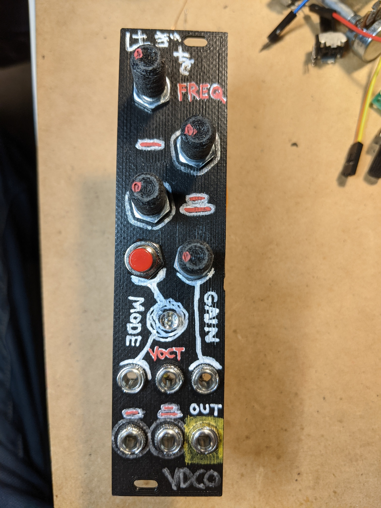
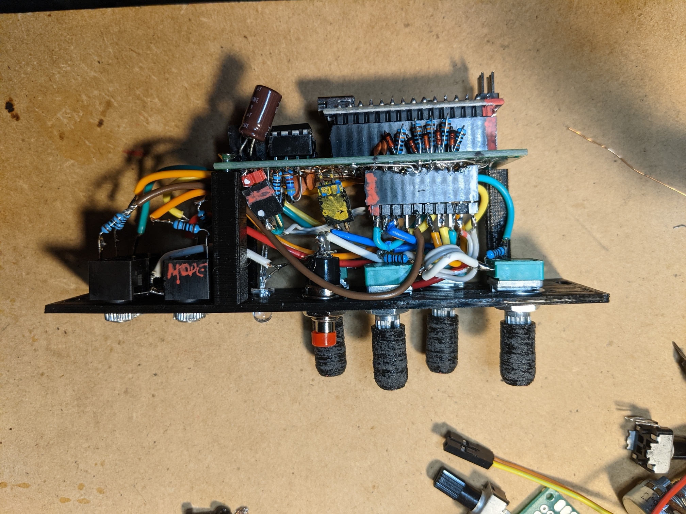

# HAGIWO VDCO Eurorack module (protoboard edition)

This is a protoboard layout for the combined [HAGIWO DVCO](https://note.com/solder_state/n/n30b3a8737b1e) (remixed by [luislutz](https://github.com/luislutz/Arduino-VDCO)) as a 4HP Eurorack module. It's based on Arduino Nano and the Mozzi library.

The module has three modes - Chord generator, Additive synth mode and FM synth mode.

  
  

Also included is a 3D printable front panel in OpenSCAD and STL format (it's tailored to my particular piece of 30x70mm protoboard with M2 screw holes in each corner, but can be easily modified where required).

Compared to the original design, this one:

- uses single 5.1V Zener diodes rather than Schottky diodes for over-voltage protection (it's what I had on hand and seems to be working fine so far).
- uses a single RGB LED rather than three LEDs.
- uses a momentary button for mode switching (with hardware debouncing)

## Build notes

It's quite tight and awkward, especially the pin header sockets. 

You might want to use a bigger bit of protoboard, space things out and mount it to the front panel at right angles instead (I avoided this because I wanted it to be skiff-friendly, under 50mm deep).

See notes in the KiCad schematic and PCB layout. 

Have fun :)

## Compiling the code

To compile the code you need to install the [Mozzi](https://github.com/sensorium/Mozzi) Arduino library and ensure that `#define AUDIO_MODE HIFI` is set in `mozzi_config.h`.

To flash my cheapo Arduino Nano clone, I needed to select "ATmega328P (Old Bootloader)" under Tools->Processor in the Arduino IDE.

## References

Original `HAGIWO` designs:

- Chords: https://note.com/solder_state/n/n681d2e07e324
- Additive: https://note.com/solder_state/n/n30b3a8737b1e
- FM: https://note.com/solder_state/n/n88317851a4c7

`luisluz` remix: https://github.com/luislutz/Arduino-VDCO

Many thanks to `HAGIWO` for sharing his designs, and `luisluz` for iterating on them.
